# `[DRAFT]` Histogram Model
by Sergei Papulin (papulin.edu@gmail.com)

<br>

## Contents

<br>

1. [Introduction](#Introduction)
2. [Histogram](#Histogram)
3. [Histogram Algebraic System](#Histogram-Algebraic-System)
4. [Examples](#Examples)
5. [Discussion](#Discussion)
6. [Conclusion](#Conclusion)
7. [References](#References)

<br>

## 1. Introduction

<br>

Histogram model can be used for data analysis and information retrieval based on the number of occurrences of elements that make up data instances. The basic unit of computation here is a histogram.

Next in this paper different types of histograms will be discussed, and then the histogram algebraic system will be introduced that is the main component of the histogram model. Finally, some simple examples of use of the histogram model will be considered.

<br>

## 2. Histograms

<br>

### 2.1. Basic definitions

<br>

Each data instance (e.g. document, image etc.), $d$, is supposed to consist of elements of the universal set, $U$.

In the histogram model two types of histograms are distinguished: a histogram of data instance, $H(d)$, and histogram of elements given a data instance, $H(X \mid d)$. 

Histogram of a data instance, $H(d)$, describes the number of occurrences of elements of the universal set, $U$. So, each element of histogram corresponds to a single element of the universal set, $x \in U$.

Histogram of elements given a data instance, $H(X \mid d)$, is a histogram of a data instance that is limited to elements of $X \subseteq U$, and other elements are disregarded. When $X$ corresponds to $U$, $H(U \mid d)$ is equal to $H(d)$.

Look at `Table 1` for a few more notations that will be used later.

<br>

<div style="text-align:center"><i>Table 1. Basic notations</i></div>

| Symbol | Definition| 
|:-:|:-|
|$U$|Universal set (all possible elements that make up data instances)|
|$x$|Element of the universal set, $x \in U$|
|$d$|Data instance|
|$N(d)$|The total number of elements in $d$|
|$X$|High-level element that is a subset of the universal set, $X\subseteq U$|
|$H(d)$|Histogram of a data instance|
|$h(x \mid d)$|Value that corresponds to element $x$ of histogram $H(d)$|
|$H(X \mid d)$|Histogram of high-level element $X$ given a data instance $d$|
|$h(x \mid X, d)$|Value that corresponds to element $x$ of histogram $H(X \mid d)$|

<br>

Now let's consider the histogram types mentioned above in detail.

<br>

### 2.2. Histogram of data instance

<br>

There are multiple notations for histograms [[2](#7.-References)]. For example, we can consider a histogram as a union of elements:

$$H(d) = \left( H \mid H=\bigcup_{x\in U}{h(x \mid d)/x}, 0 \leq h(x \mid d) \leq N(d), \sum_{x\in U}h(x \mid d) = N(d) \right),$$

where $h(x \mid d)/x$ denotes existence of element $x$ and its occurrence value, $h(x \mid d)$, in document $d$.

Alternatively, we can represent a histogram using an ordered list 

$$H(d)=\left( h(e_1), \cdots, h(e_n) \mid h(x)=h(x \mid d), 0 \leq h(x) \leq N(d), \sum_{x\in U}h(x) = N(d) \right).$$

It's often helpful to use a normalized form, where each element $x$ of a histogram calculated as 

$$h(x \mid d) = \frac{n(x \mid d)}{N(d)},$$

where $n(x \mid )$ is the number of element $x$ in a data instance.

So, the normalized histogram can be written as

$$H(d)=\left( h(e_1), \cdots, h(e_n) \mid h(x)=h(x \mid d), 0 \leq h(x) \leq 1, \sum_{x\in U}h(x) = 1 \right),$$

where $h(x \mid d)$ refers to the normalized form of the number of occurrences.

This notation of histograms will be used further throughout the paper.

Simple example of the universal set, a data instance and its histogram can be found in `Figure 1`.


<table>
    <tr style="border: 2px solid white">
        <td>
            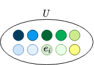       
        </td>
        <td>
            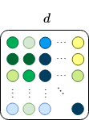
        </td>
        <td>
            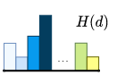
        </td>
    </tr>
    <tr style="border: 2px solid white">
        <td>
            <div style="text-align:center">a)</div>           
        </td>
        <td>
            <div style="text-align:center">b)</div> 
        </td>
        <td>
            <div style="text-align:center">c)</div> 
        </td>
    </tr>
</table>
<div style="text-align:center">
    <i>Figure 1. Representation of a data instance: (a) the universal set, (b) a data instance and (c) its histogram</i>
</div>

<br>


### 2.3. Histogram of elements given data instance

<br>

Let's denote a subset of $U$ as $X$. If $U$ is a finite set, then the set of all subsets of $U$, or the $\sigma$-algebra over $U$, is defined as follows

$$ E^G=\left\{X\vert X \subseteq U\right\}. $$

Given the aforementioned example of the universal set (see `Figure 1`), some high-level elements of $E^G$ can be represented as shown in `Figure 2`.

<div style="text-align:center">
    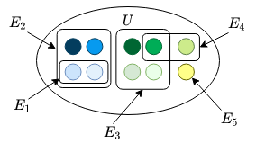<br>
    <i>Figure 2. Example of the universal set and high-level elements</i>
</div>

<br>

Each element $X$ in $E^G$ can be mapped to its histogram $H(X \mid d)$. So, the whole set of histograms for $E^G$ given a data instance $d$ is

$${H}^{G}(d) = \left \lbrace H(X|d) \mid X \in E^G \right \rbrace$$

or 

$${H}^{G}(d) = \left \lbrace (h(e_1), \cdots, h(e_n) ) \mid 0 \leq h(x) \leq h(x \mid d), \sum_{x\in X}h(x) \leq 1, X \subseteq U \right \rbrace.$$

The above definition is a general form. To be more specific, we can distinguish a restricted (or binary) form:

$${H}^{G}(d) = \left \lbrace (h(e_1), \cdots, h(e_n) ) \mid h(x) \in \{0, h(x \mid d) \}, \sum_{x\in X}h(x) \leq 1, X \subseteq U \right \rbrace.$$

And a single mapping $X$ to $H(X \mid x)$ can be defined as follows

$$ H(X \mid d) = \left(h(e_1),\cdots,h(e_n) \mid h(x)=\left\{\begin{array}{l}h(x \mid d)\;\text{if}\;x \in X,\\0\;\text{otherwise}\end{array}\right. \right) \in H^G(d).$$

An example of some high-level elements and their histograms are shown in `Figure 3` (for simplicity, $H_i$ corresponds to $H(E_i \mid d)$ and $E_i \in E^G$).

<br>

<div style="text-align:center">
    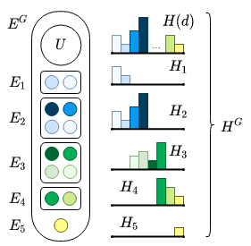<br>
    <i>Figure 3. Example of a set of high-level elements and their histograms given data instance</i>
</div>

<br>

Sum of all elements of a histogram (the counting measure) is written as

$$ \mu(H(d))={}^\Sigma H(d) = \sum_{x\in U}h(x \mid d)$$

or

$$ \mu(H(X \mid d))={}^\Sigma H(X \mid d) = \sum_{x\in U}h(x \mid X,d).$$

And we can define a measurable space

$$\left( U, E^G, \mu \right).$$

So, the number of occurrences for a given $X$ and $d$ is a sum of elements of histogram $H(X \mid d)$.

<br>

## 3. Histogram Algebraic System

<br>

### 3.1. Basic definition

<br>

As any algebraic system, the histogram one consists of a carrier set and a set of operations. Here $H^G$ is used as a carrier set, and assumed to be in the binary form (note that for fuzzy elements, for example, the binary form is not applicable and must be used the general one as shown in [[5](7.-References)]).

So, the histogram algebraic system can be denoted as follows

$$\mathcal{H} = \left\langle H^G,\cap,\cup,\land,\dot\lor,\lor,\dot\backslash,\setminus, -, \mathbf{0},\mathbf{1}\right\rangle,$$
where constants are defined as

$$\mathbf{0}=H^0=\left( h(e_1), \cdots, h(e_n) \mid h(x) = 0, x \in U \right)$$

$$\mathbf{1}=H^1=H(d)=\left( h(e_1), \cdots, h(e_n) \mid h(x) = h(x \mid d), x \in U, \sum_{x\in U}h(x)=1 \right)$$

Now, let's define the operations of the system. In general, they can be divided into two categories: set and logical operations. The set operations modify composition of histograms of high-level elements. They can be defined as follows:

- Union:

$$ H_1 \cup H_2 =\left(h(e_1),\cdots,h(e_n) \mid h(x)=\max(h(x \mid X_1,d), h(x \mid X_2, d)) \right).$$

- Intersection:

$$ H_1 \cap H_2 =\left(h(e_1),\cdots,h(e_n) \mid h(x)=\min(h(x \mid X_1, d), h(x \mid X_2, d)) \right).$$

- Subtraction:

$$ H_1 \setminus H_2 =\left(h(e_1),\cdots,h(e_n) \mid h(x)=\left\{\begin{array}{l}h(x \mid X_1, d)\;if\;h(x \mid X_2, d)=0,\\0\;\text{otherwise}\end{array}\right. \right),$$

where $H_i = H(X_i \mid d)$ and $X_i \in E^G$.

- Complement of $H$:

$$ \overline{H} = \left(h(e_1),\cdots,h(e_n) \mid h(x)=\left\{\begin{array}{l}h(x \mid d )\;if\;h(x \mid X, d ) = 0,\\0\;\text{otherwise}\end{array}\right. \right)$$ 

or

$$ \overline{H} = \mathbf{1} \setminus H, $$

where $H = H(X \mid d)$ and $X \in E^G$.

The logical operations refer to description of content of a data instance basically without changing the histogram (except OR) that are involved in calculation. The list of these operations are shown below:

- AND:

$$H_1\land H_2=\left\{\begin{array}{l}H_1\;if\;{}^\Sigma H_1 < {}^\Sigma H_2,\\H_2\;\text{otherwise}\end{array}\right..$$

- OR (it is equal to the union operation)

$$ H_1 \lor H_2 =\left(H(e_1),\cdots,H(e_n) \mid h(x)=\max(h(x \mid X_1, d), h(x \mid X_2, d)) \right).$$

- Exclusive OR:

$$ H_1\dot\lor H_2=\left\{\begin{array}{l}H_1\;if\;{}^\Sigma H_1 > {}^\Sigma H_2,\\H_2\;\text{otherwise}\end{array}\right..$$


- Exclusive subtraction:

$$ H_1\dot\backslash H_2=\left\{\begin{array}{l}0\;if\;{}^\Sigma H_2 > 0,\\H_1\;\text{otherwise}\end{array}\right..$$

- Negation:

$$ \lnot H = \left\{\begin{array}{l}\mathbf{0}\;\text{if}\;\exists x \ni h(x \mid X, d)>0,\\\mathbf{1}\;\text{otherwise}\end{array}\right.$$

or

$$ \lnot H = \mathbf{1} \dot \setminus H \in \left\{ \mathbf{0}, \mathbf{1}\right\}.$$

Properties of some operations and their combinations were considered in [[1](7.-References)].

Let's introduce additional operations for AND and excursive OR that takes into account overlapping  high-level elements $X_1$ and $X_2$ (examples that demonstrate the meaning of these operations will be shown later):

- AND that doesn't account common elements of $X_1$ and $X_2$:

$$H_1 \land_{1} H_2 = (H_1 \setminus H_2) \land (H_2 \setminus H_1). $$

- AND that assigns common elements to $X_1$ and excludes from $X_2$ and vice versa, and finally compares results:

$$H_1 \land_{2} H_2 = (H_1 \land (H_2 \setminus H_1)) \dot\lor (H_2 \land (H_1 \setminus H_2)). $$


- Exclusive OR that doesn't account common elements of $X_1$ and $X_2$:

$$H_1 \dot\lor_{1} H_2 = (H_1 \setminus H_2) \dot\lor (H_2 \setminus H_1).$$

- Exclusive OR that assigns common elements to $X_1$ and excludes from $X_2$ and vice versa, and finally compares results:

$$ H_1 \dot\lor_{2} H_2 = (H_1 \dot\lor (H_2 \setminus H_1)) \land (H_2 \dot\lor (H_1 \setminus H_2)). $$

- Exclusive OR that excludes common elements of $X_1$ and $X_2$ and only one of them must have a non-zero histogram to get a value other than the zero histogram:

$$ H_1 \dot\lor_{3} H_2 = (H_1 \dot\setminus H_2) \dot\lor (H_2 \dot\setminus H_1 ). $$

If we have an expression with $m$ elements of $E^G$, we should translate each element $X_i$ to $H_i$: 

$$ \text{Expression}(X_1, X_2, \cdots, X_m; O) \to \text{Expression}(H_1, H_2, \cdots, H_m; O) ,$$
where $O$ refers to the operations.

Then we can find a resulting histogram by evaluating the expression using the histogram algebraic system

$$ \text{Expression}(H_1, H_2, \cdots, H_m; O) \to H \in {H}^{G}.$$

<br>

### 3.2. Rules of usage

<br>

Set and logical operations have different bases, and the algebraic system imposes constraints on use of the operations in expressions. So, the basic rule is the following:

*Set operations should be applied before logic operations.*

For example,

$$((( H_1 \cap H_2  ) \setminus ( H_3 \cup H_4 )) \dot \lor H_5) \land H_6.$$

Some combinations that break the basic rule should be transformed to be more reasonable in the sense of reflecting meaning, rather than mathematics, e.g.

$$ ( X_1 \dot \lor X_2  ) \setminus X_3 \to ( X_1 \setminus X_3) \dot \lor (X_2 \setminus X_3  ), $$

$$ ( X_1 \land X_2  ) \setminus X_3 \to ( X_1 \setminus X_3) \land (X_2 \setminus X_3  ), $$

$$ ( X_1 \dot \lor X_2  ) \dot \setminus X_3 \to ( X_1 \dot \setminus X_3) \dot \lor (X_2 \dot \setminus X_3  ), $$

$$ ( X_1 \land X_2  ) \dot \setminus X_3 \to ( X_1 \dot \setminus X_3) \land (X_2 \dot \setminus X_3  ). $$

<br>

### 3.3. Queries

<br>

As mentioned in the introduction, the histogram model can be applied for information retrieval [[3,4,6](7.-References)]. There are two basic types of queries that can be used: expressions and samples.

<br>

*Expressions as a query*

<br>

In this case, a query can be specified by elements of $E^G$ and operations of the histogram model in the following way

$$ q = \text{Expression}(X_1, X_2, \cdots, X_m). $$

To calculate a value of similarity between the query and data instances, it's necessary to evaluate the histogram expression and sum the values of the resulting histogram:  

$$ \text{sim}(q, d) = \sum_{x\in U}\text{Expression}(H_1, H_2, \cdots, H_m;O)={}^\Sigma H.$$

Generally, when we use complex expressions, resulting histograms may not reflect really the number of occurrences of expressions given a data instance. Think of, for example, the AND operation. It returns one of the operands, $H_1$ or $H_2$. Here the result is just based on the number of occurrences of elements $X_1$ and $X_2$ in $d$. So the term "value of expression" is more appropriate instead of "number of occurrences of expression". But when we talk about a histogram of a single high-level element $X$, it's possible to say the number of occurrences $X$ given $d$.

<br>

*Sample as a query*

<br>

One way to calculate similarity between two data instances $d$ and $d_{sample}$ is to intersect their histograms $H(d)$ and $H(d_{sample})$. This can be written as

$$\text{sim}(d_{sample}, d) = \text{min}(H(d_{sample}), H(d))) = \left(h(e_1),\cdots,h(e_n) \mid h(x)=\min(h(x \mid d_{sample}), h(x \mid d)) \right).$$

So, the histogram representation of data instances is an appropriate form for using different types of queries that is a useful feature for information retrieval systems.

<br>

## 4. Examples

<br>

Now let's consider some examples that shed light on some nuances of the histogram model and use of its operations. This section will be divided into three parts. The first two will demonstrate the use of the operations for non-overlapping and overlapping high-level elements, respectively, and then difference between the various definitions of AND and Exclusive OR will be shown.

<br>

*Non-overlapping high-level elements*

<br>

The following high-level elements are considered here:

$$E_1 = \{e_1, e_2\},$$
$$E_2 = \{e_4, e_5\}.$$

The elements are not overlapping. Let's take 4 data instances and construct their histograms, and histograms of elements $E_1$ and $E_2$ as shown in `Figure 4`.


<br>

<table>
    <tr style="border: 2px solid white">
        <td>
            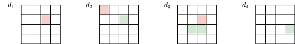       
            <div style="text-align:center">a)</div> 
        </td>
    </tr>
    <tr style="border: 2px solid white">
        <td>
            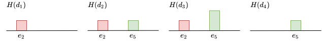  
            <div style="text-align:center">b)</div>      
        </td>
    </tr>
    <tr style="border: 2px solid white">
        <td>
            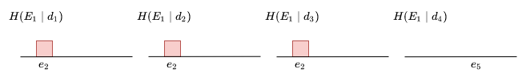    
            <div style="text-align:center">c)</div>    
        </td>
    </tr>
    <tr style="border: 2px solid white">
        <td>
            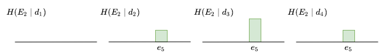    
            <div style="text-align:center">d)</div>    
        </td>
    </tr>
</table>
<div style="text-align:center">
    <i>Figure 4.  Example for non-overlapping high-level elements: (a) data instances, (b) their histograms, (c) and (d) histograms of elements. Note: For simplicity, only two elements are shown</i>
</div>

<br>

Now let's apply the all operations that was introduced previously. `Table 2` contains the resulting values of those expressions.

<br>

<div style="text-align:center"><i>Table 2. Results of evaluating expressions with non-overlapping high-level elements and various operations (note that the histograms are not normalized here)</i></div>

| | $E_1 \cup E_2$ |  $E_1 \cap E_2$ | $E_1 \setminus E_2$ | $E_1 \land E_2$ | $E_1 \land_{1} E_2$ | $E_1 \land_{2} E_2$ | $E_1 \lor E_2$ | $E_1 \dot\lor E_2$ | $E_1 \dot\lor_{1} E_2$ | $E_1 \dot\lor_{2} E_2$| $E_1 \dot\lor_{3} E_2$ | $E_1 \dot\setminus E_2$ |
|-|:-:|:-:|:-:|:-:|:-:|:-:|:-:|:-:|:-:|:-:|:-:|:-:|
|$d_1$|1|0|1|0|0|0|1|1|1|1|1|1|
|$d_2$|2|0|1|1|1|1|2|1|1|1|0|0|
|$d_3$|3|0|1|1|1|1|3|2|2|2|0|0|
|$d_4$|1|0|0|0|0|0|1|1|1|1|1|0|

<br>

<br>

*Overlapping high-level elements*

<br>

In this case, we have two high-level elements $E_1$ and $E_2$ that have one common element $e_4$:

$$E_1 = \{e_4, e_5\},$$
$$E_2 = \{e_3, e_4\}.$$

As before, let's take 4 data instances and construct their histograms, and histograms of elements $E_1$ and $E_2$ as shown in `Figure 5`.


<br>

<table>
    <tr style="border: 2px solid white">
        <td>
            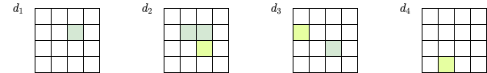       
            <div style="text-align:center">a)</div> 
        </td>
    </tr>
    <tr style="border: 2px solid white">
        <td>
            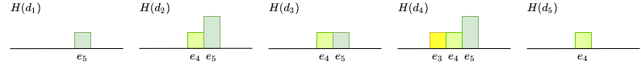  
            <div style="text-align:center">b)</div>      
        </td>
    </tr>
    <tr style="border: 2px solid white">
        <td>
            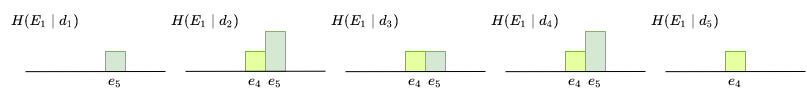    
            <div style="text-align:center">c)</div>    
        </td>
    </tr>
    <tr style="border: 2px solid white">
        <td>
                
            <div style="text-align:center">d)</div>    
        </td>
    </tr>
</table>
<div style="text-align:center">
    <i>Figure 5.  Example for overlapping high-level elements: (a) data instances, (b) their histograms, (c) and (d) histograms of elements. Note: For simplicity, only two elements are shown</i>
</div>

<br>

In `Table 3` you can find the resulting values of the expressions.

<br>

<div style="text-align:center"><i>Table 3.  Results of evaluating expressions with overlapping high-level elements and various operations (note that the histograms are not normalized here)</i></div>

| | $E_1 \cup E_2$ |  $E_1 \cap E_2$ | $E_1 \setminus E_2$ | $E_1 \land E_2$ | $E_1 \land_{1} E_2$ | $E_1 \land_{2} E_2$ |$E_1 \lor E_2$ | $E_1 \dot\lor E_2$ | $E_1 \dot\lor_{1} E_2$ | $E_1 \dot\lor_{2} E_2$ | $E_1 \dot\lor_{3} E_2$ | $E_1 \dot\setminus E_2$ |
|-|:-:|:-:|:-:|:-:|:-:|:-:|:-:|:-:|:-:|:-:|:-:|:-:|
|$d_1$|1|0|1|0|0|0|1|1|1|1|1|1|
|$d_2$|3|1|2|1|0|1|3|3|2|2|0|0|
|$d_3$|2|1|1|1|0|1|2|2|1|1|0|0|
|$d_4$|4|1|2|2|1|2|4|3|2|2|0|0|
|$d_5$|1|1|0|1|0|0|1|1|0|1|0|0|

<br>

```
TODO: Leave some comments about difference of use of AND and Exclusive OR for non-overlapping and overlapping elements

For non-overlapping elements, operations "$\dot\lor$" and "$\dot\lor_{1}$" lead to the same result.
```

<br>

*Comparison various definitions of AND and Exclusive OR*

<br>

To get better idea about difference between various of definitions of AND and Exclusive OR, turn to `Figure 7` and `Figure 8`, respectively.

<br>

<div style="text-align:center">
    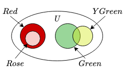<br>
    <i>Figure 6. High-level elements for comparison AND and Exclusive OR</i>
</div>

<br>


<br>

<table>
    <tr style="border: 2px solid white">
        <td>
            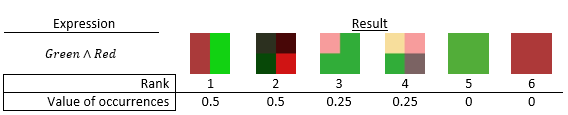       
            <div style="text-align:center">a)</div> 
        </td>
    </tr>
    <tr style="border: 2px solid white">
        <td>
            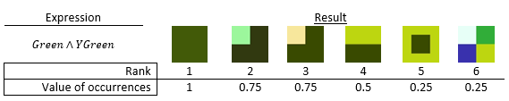  
            <div style="text-align:center">b)</div>      
        </td>
    </tr>
    <tr style="border: 2px solid white">
        <td>
            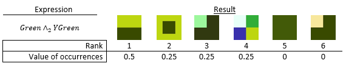    
            <div style="text-align:center">c)</div>    
        </td>
    </tr>
    <tr style="border: 2px solid white">
        <td>
            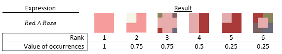    
            <div style="text-align:center">d)</div>    
        </td>
    </tr>
    <tr style="border: 2px solid white">
        <td>
            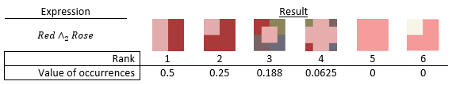 
            <div style="text-align:center">e)</div>      
        </td>
    </tr>
</table>
<div style="text-align:center">
    <i>Figure 7. Comparison of different types of the AND operation</i>
</div>

<br>

```
TODO: Leave some comments about difference of use of AND
```

<br>


<table>
    <tr style="border: 2px solid white">
        <td>
            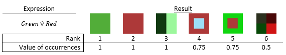 
            <div style="text-align:center">a)</div>     
        </td>
    </tr>
    <tr style="border: 2px solid white">
        <td>
            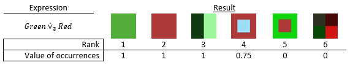 
            <div style="text-align:center">b)</div>       
        </td>
    </tr>
    <tr style="border: 2px solid white">
        <td>
            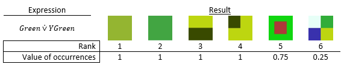    
            <div style="text-align:center">c)</div>     
        </td>
    </tr>
    <tr style="border: 2px solid white">
        <td>
            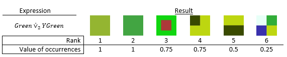
            <div style="text-align:center">d)</div>    
        </td>
    </tr>
    <tr style="border: 2px solid white">
        <td>
            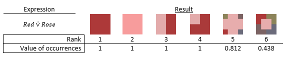  
            <div style="text-align:center">e)</div>      
        </td>
    </tr>
    <tr style="border: 2px solid white">
        <td>
            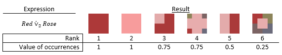     
            <div style="text-align:center">f)</div>   
        </td>
    </tr>
</table>
<div style="text-align:center">
    <i>Figure 8. Comparison of different types of the Exclusive OR operation</i>
</div>

<br>

```
TODO: Leave some comments about difference of use of Exclusive OR
```

<br>

## 5. Discussion

<br>

```
TODO
```

<br>

<div style="text-align:center"><i>Table 4. Basic models</i></div>

| Model | Meaning of Element | 
|:-|:-|
|Sets|Membership|
|Logic|Truth/falsity|
|Fuzzy sets|Degree of membership|
|Probability|Probability of outcome|
|Histogram|Occurrences|

<br>


<br>

### 5.1. Histogram model vs set model

<br>

```
TODO
```

<br>

### 5.2. Histogram model vs logic model

<br>

```
TODO
```

<br>

### 5.3. Histogram model vs probability model

<br>

A common approach for probability estimation is based on the number of occurrences for a particular outcome divided by the number of all observed outcomes. In histogram model we deal with the number of occurrences directly (or using a normalized form as well) and we don't calculate any probabilities. As a result, operations over probabilities are not applied to histograms. Moreover, the histogram algebraic system works with vectors (histograms) as a single unit.

```
TODO: Describe how we can come to probabilities from the histogram model
```

<br>

### 5.4. Histogram model vs fuzzy set model

<br>

The most obvious difference between these two models from a mathematical point of view is that a histogram is restricted by the the number of elements of a data instance, whereas a fuzzy set has no such limitations. For example, if we take a normalized histogram, sum of its elements can not more than 1, whereas for a fuzzy set, each of its element can be from 0 to 1.

As known, the fuzzy sets don't follow the law of contradiction and the law of excluded middle. In turn, the histogram model complies with the laws as shown below, respectively (over two operations: union and intersection):

$$H \cap \overline{H} = \mathbf{0},$$

$$H \cup \overline{H} = \mathbf{1}.$$

This feature is inherited from the sets.

<br>

## 6. Conclusion

<br>

```
TODO
```

<br>

## 7. References

<br>

1. Папулин, С.Ю. Свойства бинарных операций логико-гистограммного представления данных / С.Ю. Папулин // Наукоемкие технологии и интеллектуальные системы 2013: материалы 15-ой молодежной международной науч.-технич. конф. – М.: Моск. гос. техн. университет им. Н.Э. Баумана, 2013. – С. 118–124.
2. Папулин, С.Ю. Виды гистограммных представлений данных в логико-множественной модели представления / С.Ю. Папулин // Наукоемкие технологии и интеллектуальные системы 2014: материалы 16-ой молодежной международной науч.-технич. конф. – М.: Моск. гос. техн. университет им. Н.Э. Баумана, 2014. – С. 223–226.
3. Папулин, С.Ю. Анализ коллекции данных посредством логико-множественного гистограммного представления / С.Ю. Папулин // Программные продукты и системы. – 2014. – №1. – С. 57–60.
4. Папулин, С.Ю. Способ поиска изображений по содержанию на основе логико-гистограммного представления признака цвета с применением текстового запроса пользователя / С.Ю. Папулин // Итоги диссертационного исследования: материалы IV Всероссийского конкурса молодых ученых. – М.: РАН, 2012. – Т. 3. – С. 95–106.
5. Папулин, С.Ю. Нечеткие элементы в логико-множественной гистограммной модели представления данных / С.Ю. Папулин // Наукоемкие технологии и интеллектуальные системы 2014: материалы 16-ой молодежной международной науч.-технич. конф. – М.: Моск. гос. техн. университет им. Н.Э. Баумана, 2014. – С. 70–73.
6. Папулин, С.Ю. Поиск изображений по семантическим признакам: дис. … канд. техн. наук. :  05.13.01 / Папулин Сергей Юрьевич. – МГТУ им. Н.Э. Баумана. – Москва, 2014. – 214 с.