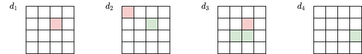
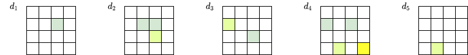

# `[DRAFT]` Inverted Indexing in Histogram Model
by Sergei Papulin (papulin.edu@gmail.com)

<br>

## Contents

<br>

- [Introduction](#Introduction)
- [Histogram Model](#Histogram-Model)
- [Inverted Index](#Inverted-Index)
- [Ranking](#Ranking)
- [Discussion](#Discussion)
- [Conclusion](#Conclusion)
- [References](#References)

<br>

## Introduction

<br>

```
TODO
```

It's crucial for information retrieval engines to build indexing to reduce search space and retrieve only a fraction of all available data instances. 

<br>

<div style="text-align:center">
    <br>
    <i>Figure 1. Indexing and search flows</i>
</div>

<br>

## Histogram Model

<br>

As shown [here](hm_basics.md), the histogram algebraic system can be written as follows

$$\mathcal{H} = \left\langle H^G,\cap,\cup,\land,\dot\lor,\lor,\dot\backslash,\setminus, -, \mathbf{0},\mathbf{1}\right\rangle,$$
where constants are defined as

$$\mathbf{0}=H^0=\left( h(e_1), \cdots, h(e_n) \mid h(x) = 0, x \in U \right)$$

$$\mathbf{1}=H^1=H(d)=\left( h(e_1), \cdots, h(e_n) \mid h(x) = h(x \mid d), x \in U, \sum_{x\in U}h(x)=1 \right)$$

There are two types of operations: set and logical. 

Set operations are defined as follows

- Union:

$$ H_1 \cup H_2 =\left(h(e_1),\cdots,h(e_n) \mid h(x)=\max(h(x \mid X_1,d), h(x \mid X_2, d)) \right).$$

- Intersection:

$$ H_1 \cap H_2 =\left(h(e_1),\cdots,h(e_n) \mid h(x)=\min(h(x \mid X_1, d), h(x \mid X_2, d)) \right).$$

- Subtraction:

$$ H_1 \setminus H_2 =\left(h(e_1),\cdots,h(e_n) \mid h(x)=\left\{\begin{array}{l}h(x \mid X_1, d)\;if\;h(x \mid X_2, d)=0,\\0\;\text{otherwise}\end{array}\right. \right),$$

where $H_i = H(X_i \mid d)$ and $X_i \in E^G$.

- Complement of $H$:

$$ \overline{H} = \left(h(e_1),\cdots,h(e_n) \mid h(x)=\left\{\begin{array}{l}h(x \mid d )\;if\;h(x \mid X, d ) = 0,\\0\;\text{otherwise}\end{array}\right. \right)$$ 

or

$$ \overline{H} = \mathbf{1} \setminus H, $$

where $H = H(X \mid d)$ and $X \in E^G$.

Logical operations are shown below:

- AND:

$$H_1\land H_2=\left\{\begin{array}{l}H_1\;if\;{}^\Sigma H_1 < {}^\Sigma H_2,\\H_2\;\text{otherwise}\end{array}\right..$$

- OR (it is equal to the union operation)

$$ H_1 \lor H_2 =\left(H(e_1),\cdots,H(e_n) \mid h(x)=\max(h(x \mid X_1, d), h(x \mid X_2, d)) \right).$$

- Exclusive OR:

$$ H_1\dot\lor H_2=\left\{\begin{array}{l}H_1\;if\;{}^\Sigma H_1 > {}^\Sigma H_2,\\H_2\;\text{otherwise}\end{array}\right..$$


- Exclusive subtraction:

$$ H_1\dot\backslash H_2=\left\{\begin{array}{l}0\;if\;{}^\Sigma H_2 > 0,\\H_1\;\text{otherwise}\end{array}\right..$$

- Negation:

$$ \lnot H = \left\{\begin{array}{l}\mathbf{0}\;\text{if}\;\exists x \ni h(x \mid X, d)>0,\\\mathbf{1}\;\text{otherwise}\end{array}\right.$$

or

$$ \lnot H = \mathbf{1} \dot \setminus H \in \left\{ \mathbf{0}, \mathbf{1}\right\}.$$

And some alternative definitions of AND and Exclusive OR:

- AND that doesn't account common elements of $X_1$ and $X_2$:

$$H_1 \land_{1} H_2 = (H_1 \setminus H_2) \land (H_2 \setminus H_1). $$

- AND that assigns common elements to $X_1$ and excludes from $X_2$ and vice versa, and finally compares results:

$$H_1 \land_{2} H_2 = (H_1 \land (H_2 \setminus H_1)) \dot\lor (H_2 \land (H_1 \setminus H_2)). $$

- Exclusive OR that doesn't account common elements of $X_1$ and $X_2$:

$$H_1 \dot\lor_{1} H_2 = (H_1 \setminus H_2) \dot\lor (H_2 \setminus H_1).$$

- Exclusive OR that assigns common elements to $X_1$ and excludes from $X_2$ and vice versa, and finally compares results:

$$ H_1 \dot\lor_{2} H_2 = (H_1 \dot\lor (H_2 \setminus H_1)) \land (H_2 \dot\lor (H_1 \setminus H_2)). $$

- Exclusive OR that excludes common elements of $X_1$ and $X_2$ and only one of them must have a non-zero histogram to get a value other than the zero histogram:

$$ H_1 \dot\lor_{3} H_2 = (H_1 \dot\setminus H_2) \dot\lor (H_2 \dot\setminus H_1 ). $$

<br>

## Queries

<br>

```
TODO
```


$$ \text{Expression}(X_1, X_2, \cdots, X_m; O) \to \text{Expression}(H_1, H_2, \cdots, H_m; O) ,$$
where $O$ refers to the operations.


$$ \text{Expression}(H_1, H_2, \cdots, H_m; O) \to H \in {H}^{G}.$$


$$ q = \text{Expression}(X_1, X_2, \cdots, X_m). $$

To calculate a value of similarity between the query and data instances, it's necessary to evaluate the histogram expression and sum the values of the resulting histogram:  

$$ \text{sim}(q, d) = \sum_{x\in U}\text{Expression}(H_1, H_2, \cdots, H_m;O)={}^\Sigma H.$$

<br>

## Inverted Index

<br>

Let $D$ denote a set of all data instances. A single data instance, $d \in D$, is a multiset of elements of $U$:

$$d = \{ e^{m(e_1)}_1, \cdots,  e^{m(e_n)}_n \}$$

where $m(e_i)$ is the number of occurrences of $e_i$ in $d$, $e_i \in U$ and $|U|=n$.

Inverted indices:

$$e_1 \rightarrow \left \{ d\mid e_1 \in d, d \in D \right \}$$
$$e_2 \rightarrow \left \{ d\mid e_2 \in d, d \in D \right \}$$
$$\vdots$$
$$e_n \rightarrow \left \{ d\mid e_n \in d, d \in D \right \}$$


Let's define a subset of data instances that contain at least one nonzero element of $X \subseteq U$ as

$$ \pi_D(X) = \{ d \mid \text{supp}(d) \cap X \neq \emptyset, d \in D \} \subseteq D,$$

where the support function is

$$\text{supp}(d)=\{ e \mid m_d(e) > 0 \}.$$

So, we can represent a relation between $X$ and $D$ as follows

$$ \pi_D: X \mapsto D_{X},$$
where $D_X \subseteq D$.

If there is an expression, we should evaluate it in a way to get a subset $D_X$ of all data instances $D$ that can be considered as relevant:

$$ \text{Expression}(X_1, X_2, \cdots, X_m; O) \to D_X $$


It's important ot note that, for example,

$$D_{X_1 \cup X_2} = D_{X_1} \cup D_{X_2},$$

but 

$$D_{X_1 \cap X_2} \neq D_{X_1} \cap D_{X_2}.$$

So,

$$X_1 \cup X_2 \to D_{X_1} \cup D_{X_2}$$

and

$$X_1 \cap X_2 \not\to D_{X_1} \cap D_{X_2}.$$

Let's define the rules of mapping expressions of high-level elements to subsets of data instances.

Set binary operations:

$$ X_1 \cup X_2 \to D_{X_{1}} \cup D_{X_{2}} = D_{X_1 \cup X_2}$$

$$ X_1 \cap X_2 \to D_{X_1 \cap X_2} $$
$$ X_1 \setminus X_2 \to D_{X_1}$$

Logical binary operations:

$$  X_1 \land X_2 \to D_{X_1} \cap D_{X_2} $$
$$  X_1 \lor X_2 \to D_{X_1} \cup D_{X_2} = D_{X_1 \cup X_2} $$
$$  X_1 \dot \lor X_2 \to D_{X_1} \cup D_{X_2} = D_{X_1 \cup X_2} $$
$$  X_1 \dot \setminus X_2 \to D_{X_1} \setminus D_{X_2} $$

We can infer rules for other operations based on their expressions and the previously mentioned rules:

$$X_1 \land_{1} X_2 \to D_{X_1} \cap D_{X_2},$$
$$X_1 \land_{2} X_2 \to (D_{X_1} \cap D_{X_2}) \cup (D_{X_2} \cap D_{X_1}) = D_{X_1} \cap D_{X_2},$$
$$X_1 \dot \lor_1 X_2 \to D_{X_1} \cup D_{X_2} = D_{X_1 \cup X_2}$$
$$X_1 \dot \lor_2 X_2 \to (D_{X_1} \cup D_{X_2}) \cap (D_{X_2} \cup D_{X_1}) = D_{X_1 \cup X_2}$$
$$X_1 \dot \lor_3 X_2 \to (D_{X_1} \setminus D_{X_2}) \cup (D_{X_2} \setminus D_{X_1})$$


Note that according to the histogram model $X_1 \lor X_2$ is equivalent to $X_1 \cup X_2$.

<br>

## Examples

<br>

*Non-overlapping high-level elements*

<br>


$$Red = \{ e_1, e_2 \}$$
$$Green = \{ e_4, e_5 \}$$

$$Red \cap Green = \emptyset$$

<br>

<table>
    <tr style="border: 2px solid white">
        <td>
                   
            <div style="text-align:center">a)</div> 
        </td>
    </tr>
    <tr style="border: 2px solid white">
        <td>
              
            <div style="text-align:center">b)</div>      
        </td>
    </tr>
    <tr style="border: 2px solid white">
        <td>
                
            <div style="text-align:center">c)</div>    
        </td>
    </tr>
    <tr style="border: 2px solid white">
        <td>
                
            <div style="text-align:center">d)</div>    
        </td>
    </tr>
</table>
<div style="text-align:center">
    <i>Figure 2.  Example for non-overlapping high-level elements: (a) data instances, (b) their histograms, (c) and (d) histograms of elements. Note: For simplicity, only two elements are shown</i>
</div>

<br>


<!-- $$ R \to \{ d_1, d_2 \} \cup \{ d_1, d_2 \} \cdots=\{ d_1, d_2 \}  $$

$$ B \to \{  \} \cup \{ d_1 \} \cup = \{ d_2, d_3 \}$$ -->


Set operations:

$$Red \cup Green \to \{d_1, d_2, d_3\} \cup \{d_2, d_3, d_4\} = \{d_1, d_2, d_3, d_4\},$$
$$Red \cap Green \to \emptyset,$$
$$Red \setminus Green \to \{d_1, d_2, d_3 \}.$$

Logical operations:

$$Red \land Green \to \{d_1, d_2, d_3 \} \cap \{d_2, d_3, d_4 \} = \{ d_2, d_3 \},$$
$$Red \lor Green \to \{d_1, d_2, d_3\} \cup \{d_2, d_3, d_4\} = \{d_1, d_2, d_3, d_4\},$$
$$Red \dot\lor Green \to \{d_1, d_2, d_3\} \cup \{d_2, d_3, d_4\} = \{d_1, d_2, d_3, d_4\},$$
$$Red \dot \setminus Green \to \{ d_1, d_2, d_3 \} \setminus \{d_2, d_3, d_4 \} = \{d_1 \}.$$

Additional operations:

$$Red \land_{1} Green = \{d_1, d_2, d_3 \} \cap \{d_2, d_3, d_4 \} = \{ d_2, d_3 \},$$
$$Red \land_{2} Green = \{d_1, d_2, d_3 \} \cap \{d_2, d_3, d_4 \} = \{ d_2, d_3 \},$$
$$Red \dot \lor_1 Green \to \{d_1, d_2, d_3\} \cup \{d_2, d_3, d_4\} = \{d_1, d_2, d_3, d_4\},$$
$$Red \dot \lor_2 Green \to \{d_1, d_2, d_3\} \cup \{d_2, d_3, d_4\} = \{d_1, d_2, d_3, d_4\},$$
$$  Red \dot \lor_3 Green \to \{ d_1, d_2, d_3 \} \setminus \{d_2, d_3, d_4 \} \cup \{d_2, d_3, d_4 \} \setminus \{ d_1, d_2, d_3 \} = \{ d_1, d_4 \}.$$


<br>

*Overlapping high-level elements*

<br>

$$Green = \{ e_4, e_5 \}$$
$$YGreen = \{ e_3, e_4 \}$$
$$Green \cap YGreen = \{ e_4 \}$$

<br>

<table>
    <tr style="border: 2px solid white">
        <td>
                   
            <div style="text-align:center">a)</div> 
        </td>
    </tr>
    <tr style="border: 2px solid white">
        <td>
              
            <div style="text-align:center">b)</div>      
        </td>
    </tr>
    <tr style="border: 2px solid white">
        <td>
                
            <div style="text-align:center">c)</div>    
        </td>
    </tr>
    <tr style="border: 2px solid white">
        <td>
                
            <div style="text-align:center">d)</div>    
        </td>
    </tr>
</table>
<div style="text-align:center">
    <i>Figure 3.  Example for overlapping high-level elements: (a) data instances, (b) their histograms, (c) and (d) histograms of elements. Note: For simplicity, only two elements are shown</i>
</div>

<br>

Set operations:

$$Green \cup YGreen \to \{d_1, d_2, d_3, d_4, d_5\} \cup \{d_2, d_3, d_4, d_5 \} = \{d_1, d_2, d_3, d_4, d_5\},$$
$$Green \cap YGreen \to \{ d_2, d_3, d_4, d_5 \} $$
$$Green \setminus YGreen \to \{d_1, d_2, d_3, d_4, d_5 \} $$

Logical operations:

$$Green \land YGreen \to \{d_1, d_2, d_3, d_4, d_5 \} \cap \{d_2, d_3, d_4, d_5 \} = \{ d_2, d_3, d_4, d_5 \} $$
$$Green \lor YGreen \to \{d_1, d_2, d_3, d_4, d_5\} \cup \{d_2, d_3, d_4, d_5\} = \{d_1, d_2, d_3, d_4, d_5\} $$
$$Green \dot\lor YGreen \to \{d_1, d_2, d_3, d_4, d_5\} \cup \{d_2, d_3, d_4, d_5\} = \{d_1, d_2, d_3, d_4, d_5\} $$
$$Green \dot \setminus YGreen \to \{ d_1, d_2, d_3, d_4, d_5 \} \setminus \{d_2, d_3, d_4, d_5 \} = \{d_1 \} $$

Additional operations:

$$Green \land_{1} YGreen = \{d_1, d_2, d_3, d_4, d_5\} \cap \{d_2, d_3, d_4, d_5 \} = \{ d_2, d_3, d_4, d_5\},$$
$$Green \land_{2} YGreen = \{d_1, d_2, d_3, d_4, d_5 \} \cap \{d_2, d_3, d_4, d_5 \} = \{ d_2, d_3, d_4, d_5 \},$$
$$Green \dot \lor_1 YGreen \to \{d_1, d_2, d_3, d_4, d_5\} \cup \{d_2, d_3, d_4, d_5\} = \{d_1, d_2, d_3, d_4, d_5\},$$
$$Green \dot \lor_2 YGreen \to \{d_1, d_2, d_3, d_4, d_5\} \cup \{d_2, d_3, d_4, d_5\} = \{d_1, d_2, d_3, d_4, d_5\},$$
$$  Green \dot \lor_3 YGreen \to \{ d_1, d_2, d_3, d_4, d_5 \} \setminus \{d_2, d_3, d_4, d_5 \} \cup \{d_2, d_3, d_4, d_5 \} \setminus \{ d_1, d_2, d_3, d_4, d_5 \} = \{ d_1 \} $$

<br>

## Ranking

<br>

If we have a query $X$, we restrict search to a subset $D_X$ of all data instances $D$ by means of inverted indices. To rank data instances in $D_X$, for each data instance $d$ in $D_X$ we have to calculate ${}^\Sigma H(X \mid d)$. 

**Example**

<br>

<div style="text-align:center">
    <br>
    <i>Figure 4. Set of data instances and their histograms. Note: For simplicity, only two elements are shown</i>
</div>

<br>

Inverted Indices:

$$e_2 \rightarrow \left \{ d_1, d_2, d_3 \right \}$$
$$e_5 \rightarrow \left \{ d_2, d_3, d_4 \right \}$$

Calculation

$$  Red \land Green \to D_{Red} \cap D_{Green} = \{ d_1, d_2, d_3 \} \cap \{d_2, d_3, d_4 \} = \{ d_2, d_3 \} $$


We should rank the subset of data instances $D_{Red \land Green}$ based on histogram values. For each data instance $d_i$ from $D_{Red \land Green}$ we should find a histogram $H(Red \land Green \mid d_i)$, and calculate its value. So,

$$  H(Red \land Green \mid d_i) = H(Red \mid d_i) \land H(Green \mid d_i)  \in H^{G}(d_i) $$ 

or in a concise form

$$  H_{Red \land Green, i} = H_{Red, i} \land H_{Green, i} $$

and a histogram value as a similarity measure between the query and data instance is

$$  \text{sim}(H(d_i), Red \land Green)) = {}^\Sigma H_{Red \land Green, i} = {}^\Sigma(H_{Red, i} \land H_{Green, i}) $$


Table 1. Ranking data instances for query $Red \land Green$ 
| Rank | Doc | Histogram value|
|:-:|:-:|:-:|:-:|:-:|:-:|:-:|:-:|:-:|:-:|
|1|$d_3$|2||
|2|$d_2$|1||

<br>

## Discussion

<br>

```
TODO
```
<!--Tolerance value $\alpha$ to introduce a soft threshold for exclusive operations-->

<br>

## Conclusion

<br>

```
TODO
```

<br>

## References

<br>

1. Папулин, С.Ю. Анализ коллекции данных посредством логико-множественного гистограммного представления / С.Ю. Папулин // Программные продукты и системы. – 2014. – №1. – С. 57–60.
2. Папулин, С.Ю. Анализ многоблочных данных посредством логико-множественного гистограммного представления / С.Ю. Папулин // Научное обозрение. – 2014. – №2. – С. 72–77.
3. Папулин, С.Ю. Поиск изображений по семантическим признакам: дис. … канд. техн. наук. :  05.13.01 / Папулин Сергей Юрьевич. – МГТУ им. Н.Э. Баумана. – Москва, 2014. – 214 с.