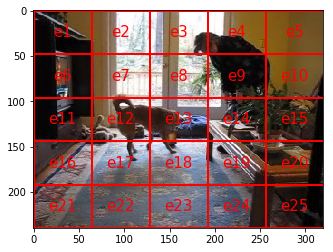

# `[DRAFT]` Multidimensional Histogram Model

by Sergei Papulin (papulin.edu@gmail.com)

<br>

## Contents

<br>

- [Introduction](#Introduction)
- [Multidimensional Histogram](#Multidimensional-Histogram)
- [Histogram Algebraic System](#Histogram-Algebraic-System)
- [Examples](#Examples)
- [Conclusion](#Conclusion)
- [References](#References)

<br>

## Multidimensional Histogram

<br>

For a multidimensional case the main definitions of the histogram model stay the same as shown [here](hm_basics.md). So, we have the universal set, $U$, and elements of a histogram correspond to its elements. However, now each element $x \in U$ is a vectors $(x_{1}, \cdots , x_{m})$, and $U$ is the Cartesian product over $m$ sets $U_1,\cdots, U_m$, denoted $U_1 \times \cdots \times U_m$, where $m$ is the number of dimensions, $U_i$ is the universal set of the $i$th dimension and $x_i$ belongs to $U_i$.

Histogram of a data instance can be represented as

$$H(d)=\left( h(e_1 \mid d), \cdots, h(e_n \mid d) \mid 0 \leq h(x \mid d) \leq 1, \sum_{x\in U}h(x \mid d) = 1 \right),$$

where $e_i = (e_{1,i_1}, \cdots , e_{m,i_m})$ and $e_{j,i_k} \in U_{j}$


The set of all high-level elements is defined as 

$$ E^G=\left\{X\vert X \subseteq U\right\}, $$

where $X$ can be represented as follows 

$$X = \{ (e_1, \cdots, e_m) \mid e_j \in U_{j} \} \subseteq U$$


In a general form we can write it as 

$$X = (X_{1,i_1}, \cdots , X_{m,i_m}), $$

where $X_{j,i_j} \subseteq U_j$.

And for the case when we use the Cartesian product of universal sets that each of them represents a single dimension (or a data feature), $X$ can be defined as:

$$X = \{ (e_1, \cdots, e_m) \mid e_j \in X_{j,i_j} \} \subseteq U.$$

The general form will be used later for querying as it is a more convenient and natural way to represent high-level elements for each dimension (see an image retrieval example below). 

<br>

## Histogram Algebraic System

<br>

Histogram algebraic system for the multidimensional case is the same as for the one-dimensional case (see [here](hm_basics.md)). There is no difference in definitions of the carrier and operations, but here we refer to multidimensional $U$:

$$\mathcal{H} = \left\langle H^G,\cap,\cup,\land,\dot\lor,\lor,\dot\backslash,\setminus, -, \mathbf{0},\mathbf{1}\right\rangle.$$

For example, the "AND" operation in query $X_1 \land X_2$ remains unchanged:

$$H_1\land H_2=\left\{\begin{array}{l}H_1\;if\;{}^\Sigma H_1 < {}^\Sigma H_2,\\H_2\;\text{otherwise}\end{array}\right.,$$

where 

$$H_k = H(X_k \mid d) = H((X_{k,1,i_1}, \cdots , X_{k,m,i_m}) \mid d) = H(\{ (e_1, \cdots, e_m) \mid e_j \in X_{k,j,i_j} \} \mid d)$$

and

$$ {}^\Sigma H(X_k \mid d) = \sum_{x\in U}h(x \mid X_k,d).$$


<br>

## Examples

<br>

Here is a 2-dimensional case for image retrieval where two features are used - positions and objects. Figure 1 depicts the image segmentation by these two features.

<br>
<table>
    <tr style="border: 2px solid white">
        <td>
            
            <div style="text-align:center">a)</div>           
        </td>
        <td>
            
            <div style="text-align:center">b)</div> 
        </td>
    </tr>
</table>
<div style="text-align:center">
    <i>Figure 1. Image segmentation by (a) positions and (b) objects</i>
</div>
<br>

User should submit a query to get a subset of relevant images. For example, 

$$Q = (Left, Dog) \land (Center, Person).$$

Here we use the general form of query representation. The high-level elements are defined as follows  

$$Left = \{ e_{1,1}, e_{1,2}, e_{1,6}, e_{1,7}, e_{1,11}, e_{1,12}, e_{1,16}, e_{1,17}, e_{1,21}, e_{1,22} \},$$

$$Dog = \{ e_{2, 1} \},$$

$$Center = \{ e_{1,7}, e_{1,8}, e_{1,9}, e_{1,12}, e_{1,13}, e_{1,14}, e_{1,17}, e_{1,18}, e_{1,19} \},$$

$$Person = \{ e_{2,2} \}.$$


For this query, the output result is shown below in figure 2.

<div style="text-align:center">
    <br>
    <i>Figure 2. Result of image retrieval for the query</i>
</div>

## Conclusion

```
TODO
```

## References

1. Папулин, С.Ю. Анализ коллекции данных посредством логико-множественного гистограммного представления / С.Ю. Папулин // Программные продукты и системы. – 2014. – №1. – С. 57–60.
2. Папулин, С.Ю. N-мерное логико-гистограммное представление данных / С.Ю. Папулин // Наукоемкие технологии и интеллектуальные системы 2013: материалы 15-ой молодежной международной науч.-технич. конф. – М.: Моск. гос. техн. университет им. Н.Э. Баумана, 2013. – С.  337–339.
3. Папулин, С.Ю. Поиск изображений по семантическим признакам: дис. … канд. техн. наук. :  05.13.01 / Папулин Сергей Юрьевич. – МГТУ им. Н.Э. Баумана. – Москва, 2014. – 214 с.
4. Власов А. И., Папулин С. Ю. Анализ данных с использованием гистограммной модели комбинации признаков / Власов А. И., Папулин С. Ю. // Нейрокомпьютеры: разработка, применение. - 2019. - Т. 21, № 5. - С. 18-27.
5. COCO (Dataset): Common Objects in Context
4. [Papulin S. Histogram Model](hm_basics.md)